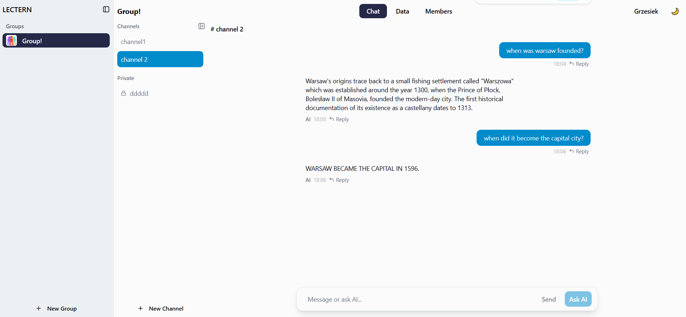
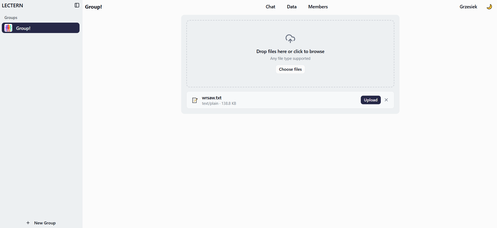
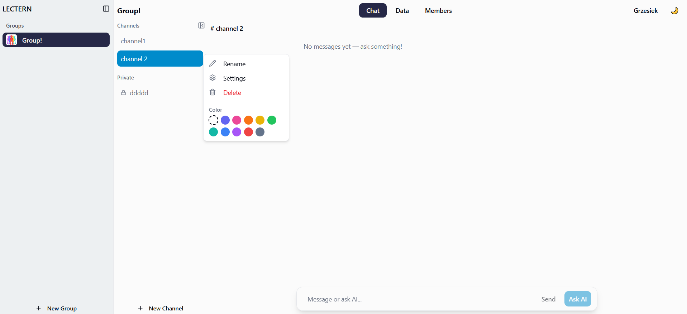
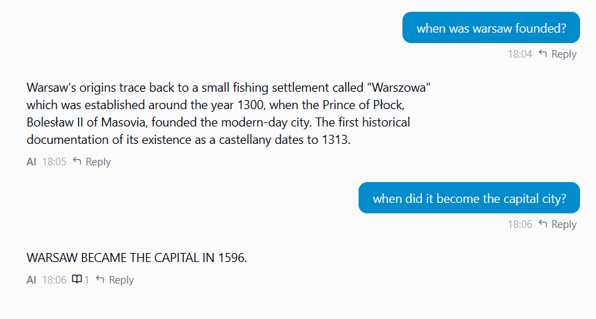

My Final IADT Year 4 graduation project.

Created using Nest.js, React, postgres, TypeScript and ShadCN.

A platform Designed to let users create groups, chat to each other, upload files, and mainly let users ask questions about the files they uploaded.

The uploaded data is proccessed in a RAG (reseacrh augmented generation) pipeline and stored as vectors, that are later retrieved and used as context to answer questions.

uploading a file, there is also an option to upload directly from a linked onedrive account

uploaded data in a given group

members

creating a new channel

asking a question to an ai (chatgpt in this case)

gpt answers and it lists sources it used

we can also do custom settings

