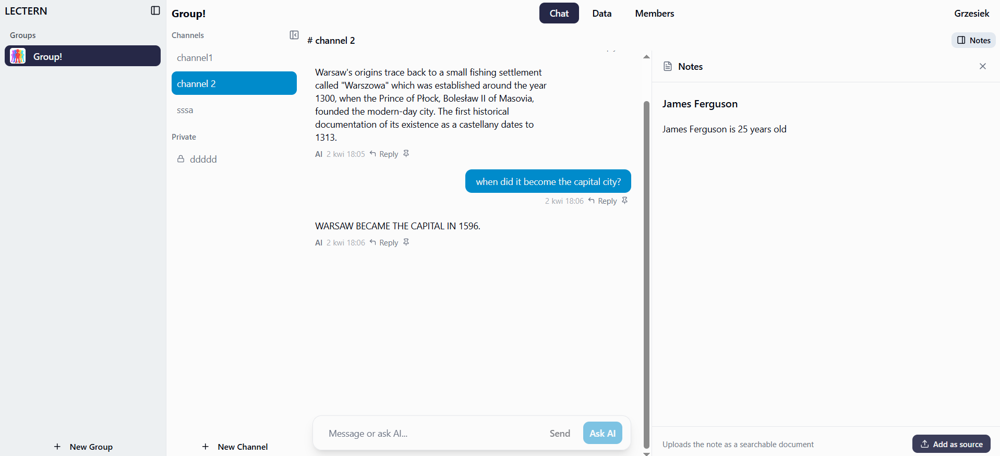
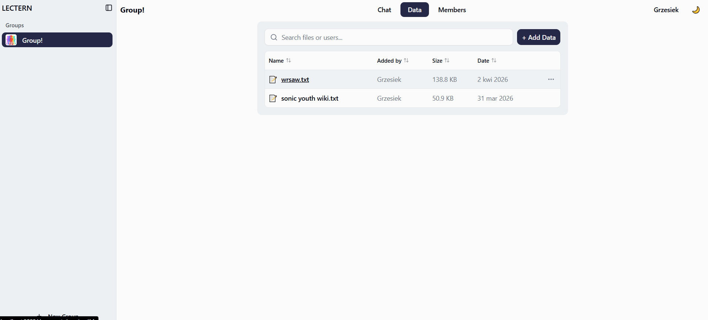

My Final IADT Year 4 graduation project.

INSTALL INSTRUCTIONS:

frontend:
cd frontend
npm install
npm run dev

backend:
cd backend
npm install
npm run start:dev

database:
# Create the database and enable pgvector
createdb lectern
psql -d lectern -c "CREATE EXTENSION IF NOT EXISTS vector;"

migrations:
# Run database migrations
cd backend
npx prisma migrate deploy
# or, for development:
npx prisma migrate dev

supabase for storing files:
1. Go to https://app.supabase.com and create a new project.
2. Create a storage bucket for images.
3. Get your Supabase URL and anon/public API key.
4. Add these to your backend .env file.

## Microsoft Integration

This project uses Microsoft services (e.g., Azure AD, Microsoft Graph, or OneDrive) for authentication and/or file storage.

- You will need to register an application in the [Azure Portal](https://portal.azure.com/).
- Set up the required permissions (e.g., Files.ReadWrite, User.Read).
- Add your Microsoft client ID, tenant ID, and client secret to your `.env` file.

See the official Microsoft documentation for detailed setup steps.

Hosted on    lectern-frontend-wygm.onrender.com

Created using Nest.js, React, postgres, TypeScript and ShadCN.

A platform Designed to let users create groups, chat to each other, upload files, and let users ask questions about the files they uploaded.

The uploaded data is proccessed in a RAG (reseacrh augmented generation) pipeline and stored as vectors, that are later retrieved and used as context to answer questions.

uploading a file, there is also an option to upload directly from a linked onedrive account

uploaded data in a given group

members

creating a new channel

asking a question to an ai (chatgpt in this case)

gpt answers and it lists sources it used

we can also do custom settings

Note Taking

Using Notes as sources

